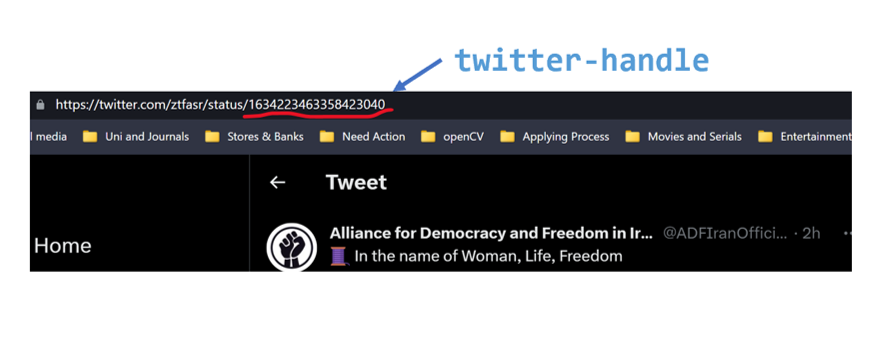

# Twitter Watch
Twitter Watch is a tool that monitors tweets and replies from selected Twitter accounts and extracts information such as conversation threads, active audiences, and sentiment scores. It also provides REST API endpoints. The source code is available on GitHub.

## Limitation
This bot only works with English tweets, and there is a limitation of 1000 replies.
## How it Works
To use this bot, it needs to open this IP: http://68.183.116.244:5000/. Then to monitor a specific tweet, you need to copy its tweet ID directly from the Twitter website. This ID is a 19-digit number, which should be used as the Twitter handle.
The following REST API endpoints are available:
- `/accounts`: returns a JSON list of all tracked accounts.
- `/tweets/twitter-handle`: returns a JSON of the user's conversation threads since the start.
- `/audience/twitter-handle`: returns a JSON of information about the audience for a user's account.
- `/sentiment/twitter-handle`: returns a JSON about the sentiment information of an account (e.g., thread level, audience level).

